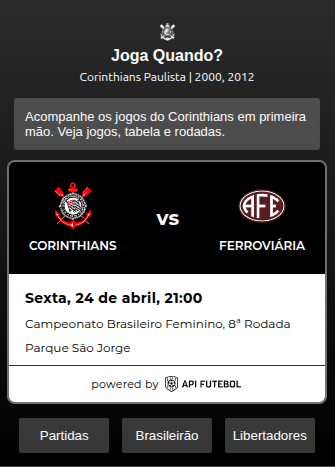
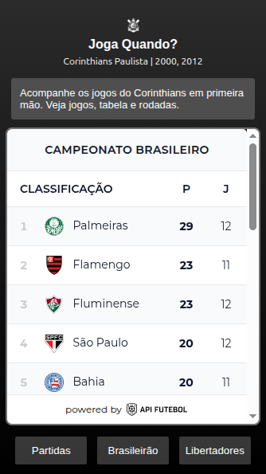
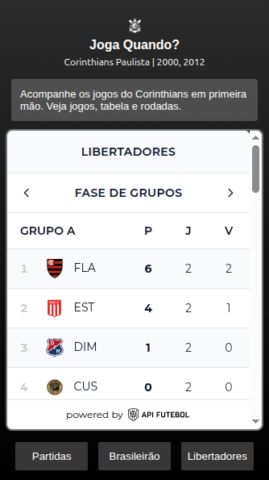

# Joga Quando?
A extensão de navegador “Joga Quando?” É uma alternativa eficiente e eficaz para visualizar os próximos jogos do clube Corinthians Paulista. Também é possível ver posicionamentos em tabelas de dois campeonatos diferentes (Brasileirão e Libertadores). Ideal para quem busca velocidade em informações básicas.

## Tecnologias
- JavaScript
- HTML5
- CSS3
- JSON

## Funcionalidades
Ao abrir a extensão com apenas um clique, é possível visualizar o próximo jogo do seu time do coração. Na parte inferior, estão disponíveis consultas rápidas, como posicionamento na tabela do Campeonato Brasileiro e disputa de grupos pela Libertadores.

## Preview Interface

  
    Próxima partida.
  
    Campeonato brasileiro.
  
    Libertadores.

## Como funciona?
Inicialmente, o projeto seria feito por meio do consumo de APIs, mas, após um estudo de viabilidade, o projeto foi adaptado a uma alternativa gratuita, utilizando widgets disponibilizados pela API Futebol.

 A ferramenta conta com um arquivo JSON (manifest.json) — indispensável para leitura do browser —, funciona como uma ponte que conecta navegador e HTML. O mesmo arquivo HTML (popup.html) define todo o layout base, alimentado via JavaScript (popup.js) e estilizado por CSS (style.css). Também carrega duas (2) imagens, respectivamente, a logo principal e uma imagem para estilização do layout.

## Como utilizar?
Para utilizar a ferramenta, será necessário fazer o download dos arquivos e carregá-los manualmente. Para isso, faça os seguintes passos simples: (1) acesse: chrome://extensions/; (2) ative o modo desenvolvedor (canto superior direito); (3) clique em “carregar sem compactação”; (4) escolha a pasta do projeto; (5) portanto, a instalação da extensão já está feita. Caso seja de sua preferência, basta apenas fixá-la.

## Conclusão
A extensão “Quando Joga?”. Foi desenvolvida em torno de 3 horas. Possíveis melhorias podem ser implementadas futuramente, visando maior controle do usuário e também mais funcionalidades.

Atualmente o projeto apresenta limitações, como: não é possível o usuário escolher qual categoria deseja acompanhar (por exemplo: feminino, masculino, categorias de base); não há descrições completas, como “onde assistir” ou “desfalques (para jogadores lesionados ou suspensos)”; no momento, é possível verificar a tabela de apenas 2 campeonatos, Brasileirão e Libertadores. Para evitar poluição visual, foram escolhidos apenas 3 botões; logo, outros campeonatos não serão exibidos.
